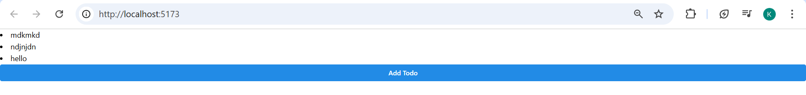

# Notes

```
{data?.map((todo: Todo) => {
    return (
        <List>
            <List.Item key=`todo__${todo.id}`>{todo.title}</List.Item>
        </List>
    )
})}
```

Hasil



```
<Box
    style={() => ({
    padding: '2rem',
    width: '100%',
    maxWidth: '40rem',
    margin: '0 auto'
    })}>
    {data?.map((todo: Todo) => {
    return (
        <List spacing='xs' size='sm' mb={12}>
        <List.Item key={`todo__${todo.id}`}>{todo.title}</List.Item>
        </List>
    )
})}
```

Hasil


```
<List spacing='xs' size='sm' mb={12}>
    <List.Item key={`todo__${todo.id}`}
        icon = {
            todo.done ? (
            <ThemeIcon color='teal' size={24} radius='xl'>
                <CheckCircleFillIcon size={24}/>
            </ThemeIcon>) : (
            <ThemeIcon color='gray' size={24} radius='xl'>
                <CheckCircleFillIcon size={24}/>
            </ThemeIcon>
            )
        }
    >{todo.title}</List.Item>
</List>
```
Hasil

